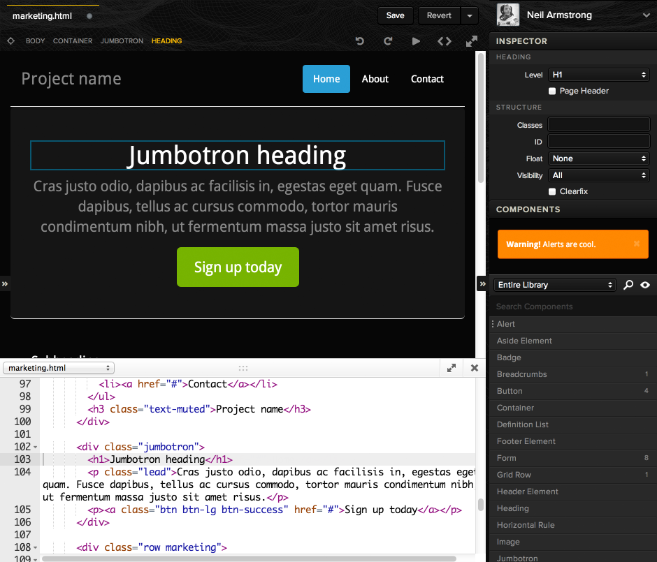
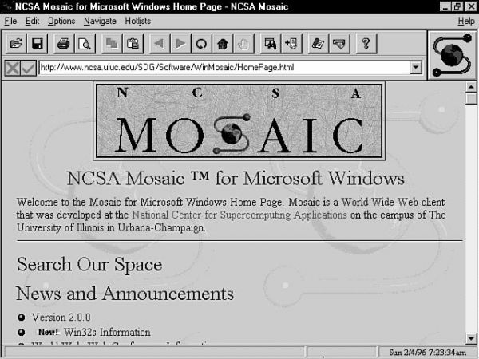

# Web Components in Action
### Fluent 2014

Created by **Michael Bleigh ([@mbleigh](http://twitter.com/mbleigh))** of **[Divshot](http://www.divshot.com/)**

===

# About Me

---

# Divshot
## Tools for the Static Web

---

# Bootstrap Drag-n-Drop


===

# A Roadmap

1. What are web components?
2. Why are they important?
3. How do I use web components to **actually build things**?

===

# Before we Begin...

---

# Chrome Dev Channel

---

# Get Experimental
## Enable these Chrome Features

1. Enable experimental Web Platform features.
2. Enable HTML Imports.

---

# Clone Me

`git clone https://github.com/mbleigh/web-components-in-action.git`

---

# Run the Materials

```
bower install
npm install -g superstatic
superstatic
```

Now just go to  `http://localhost:3474`

---

# Audience Survey
## Let's get to know each other.

===

# Origins of Web Components

---

## In The Beginning...



---

## But Today...


---

# Web Sites != Web Apps

---

# Frameworks are Great! But...

---

# Is This What We Want?

```html
<div class="dropdown">
  <button class="btn dropdown-toggle sr-only" type="button" id="dropdownMenu1" data-toggle="dropdown">
    Dropdown
    <span class="caret"></span>
  </button>
  <ul class="dropdown-menu" role="menu" aria-labelledby="dropdownMenu1">
    <li role="presentation"><a role="menuitem" tabindex="-1" href="#">Action</a></li>
    <li role="presentation"><a role="menuitem" tabindex="-1" href="#">Another action</a></li>
    <li role="presentation"><a role="menuitem" tabindex="-1" href="#">Something else here</a></li>
    <li role="presentation" class="divider"></li>
    <li role="presentation"><a role="menuitem" tabindex="-1" href="#">Separated link</a></li>
  </ul>
</div>
```

---

# Wouldn't It Be Nice...

```html
<dropdown-menu label="Dropdown">
  <dropdown-item href="#">Action</dropdown-item>
  <dropdown-item href="#">Another Action</dropdown-item>
  <dropdown-divider></dropdown-divider>
  <dropdown-item href="#">Separated Link</dropdown-item>
</dropdown-menu>
```

---

# Web Components Are

* Encapsulated
* Reusable
* **Browser-Native** (soon)
* Not just for UI

---

# Web Components Are

* HTML Imports
* Templates
* Shadow DOM
* Custom Elements

===

# HTML Imports

```html
<link rel="import" href="antiquities.html">
```

---

## What HTML Imports Do

* Fetch imported documents (recursively) 
* Make imported DOM available on the `<link>` element
* Add to page styles and scripts
* **Define custom elements**

---

## HTML Imports Do Not Work Like This

```html
<!doctype html>
<html>
  <body>
    <link rel="import" href="header.html">
    <!-- Page Content Here -->
    <link rel="import" href="footer.html">
  </body>
</html>
```

---

# HTML Imports Work Like This

```html
<link rel="import" href="other-page.html" id="other-page">
<script>
  var otherDoc = document.getElementById('other-page').import;
  otherDoc.querySelector('#neato');
</script>
```
---

# Simple Content Import
[Shared Content HTML Imports Example](/examples/html-imports/content.html)

---

# For Now:
## HTML Imports = Custom Element Loaders

===

# The Template Tag
## Inert DOM has never been so fun.

---

# Dead Simple

```html
<template id="my-template">
  <script>alert("Don't run me!");</script>
  <header>This is some content.</header>
  <section>But it's inert.</section>
</template>
```

```js
var template = document.querySelector('#my-template');
document.body.appendChild(
  document.importNode(template.content, true); // second argument is 'deep'
);
```

---

# How is it Different?

1. **Inert.** Images aren't loaded, scripts aren't run.
2. **Invisible.** Does not render, will not until activated.
3. **Goes Anywhere.** Can be inlined at *any* point in the HTML.
4. **A DOM Apart.** `querySelector` won't find its content.

===

# The Shadow DOM
## Coolest Sounding Standard. Ever.

---

# We Know to Separate Content and Presentation

---

# But what if CSS isn't enough?

---

# JS Makes DOMs Dirty

---

# Shadow DOM Cleans it Up

---

# For Example, Syntax Highlighting Looks Nice...

```js
// so highlight
var doge = function(word) {
  return "such " + word + ". much wow";
}
```

---

# ...On the Outside

```html
<code class="lang-js actionscript"><span class="comment">// so highlight</span>
<span class="keyword">var</span> doge = <span class="function"><span class="keyword">function</span><span class="params">(word)</span> {</span>
  <span class="keyword">return</span> <span class="string">"such "</span> + word + <span class="string">". much wow"</span>;
}
</code>
```

---

# Let's fix it!

[Clean Syntax Highlighting with Shadow DOM](../examples/shadow-dom/clean-highlight.html)

---

# But Wait! There's More

---

# Style Encapsulation

```html
<template>
  <style>
    /* these styles are scoped to the shadow root */
    :host { /* applies to the hosting element */ }
    #shadow-only { color: black; }
  </style>
  
  <p id="shadow-only">This is only in the Shadow</p>
</template>
```

---

# Exercise One
## Shadow DOM Dismissable

`exercises/01-shadow-dismissable` ([readme](https://github.com/mbleigh/web-components-in-action/tree/master/exercises/01-shadow-dismissable))

---

# Neato!
## But something feels a bit off...

---

# What happens if...

1. The DOM changes and we have new dismissables added?
2. We need configuration options that don't easily map to a class name?
3. We don't want to pollute our CSS class space with behaviors?

===

# Custom Elements
## The Raison d'être

---

# All Together Now

* HTML Imports to load custom elements
* Shadow DOM for under-the-hood display
* Template tags to define structure
* **Plus:** Lifecycle events and API encapsulation

---

# Library Optional
## (But STRONGLY recommended)

---

# Polymer
[polymer-project.org](http://www.polymer-project.org/)

---

# X-Tags / Brick
[x-tags.org](http://www.x-tags.org/) / [mozilla.github.io/brick](http://mozilla.github.io/brick/)

---

# Bare Metal

```js
// Elements MUST have a dash in the name
var MyElement = document.registerElement('my-element', {
  prototype: Object.create(HTMLElement.prototype, {
    prop: {
      get: function() { return 'foo'; }    
    }
  }
});
```

(we won't be doing this today)

---

# Polymer Elements

```html
<link rel="import" href="/bower_components/polymer/polymer.html">

<polymer-element name="my-element" noscript>
  <template>
    <span>Hello from <b>my-element</b>. This is my Shadow DOM.</span>
  </template>
</polymer-element>

<my-element></my-element>
```

---

# Adding Attributes

```html
<polymer-element name="name-tag" noscript>
  <template>
    <span>The name's {{last}}. {{first}} {{last}}.</span>
  </template>
</polymer-element>
```

---

# Powerful Composition
[Example: GitHub User Card Custom Element](/examples/custom-elements/github-user.html)

---

# Bringing in Scripts

```js
<polymer-element name="annoying-alert">
  <script>
    Polymer('annoying-alert', {
      attached: function() {
        this.alert(this.textContent);
      }
    });
  </script>
</polymer-element>
```

Elements don't have to have a visual component.

---

# Lifecycle Methods

* `created`: the element has been created
* `ready`: the element has been fully prepared
* `attached`: the element is live in the DOM with children/parents
* `detached`: the element was removed from the DOM
* `attributeChanged`: an attribute of the element was changed
* `<attribute>Changed`: shortcut for individual attribute change

---

# Exercise Two
`exercises/02-markdown-element` ([readme](https://github.com/mbleigh/web-components-in-action/tree/master/exercises/02-markdown-element)